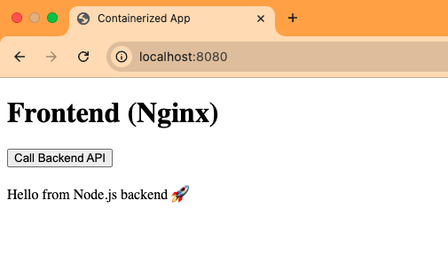
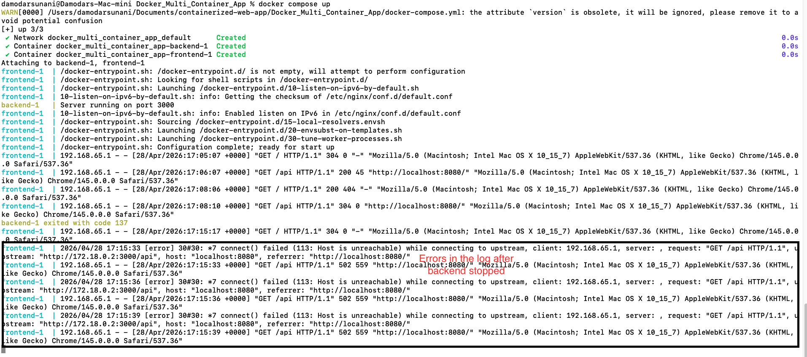

# 🚀 Containerized Web Application (Nginx + Node.js)

## Overview

This project demonstrates a **multi-container web application** using Docker and Docker Compose. It includes a frontend served by Nginx and a backend API built with Node.js.

The application showcases how services communicate within a containerized environment using internal networking, similar to real-world microservice architectures.

---

## 🧱 Architecture

Browser → Nginx (Frontend) → Node.js API (Backend)

* **Frontend**: Serves static HTML and acts as a reverse proxy
* **Backend**: Provides API response (`/api`)
* **Docker Compose**: Manages multi-container setup

---

## 🛠️ Tech Stack

* Docker
* Docker Compose
* Nginx (Reverse Proxy)
* Node.js (Express API)
* HTML / JavaScript

---

## 📂 Project Structure
```text
.
containerized-web-app/
├── frontend/
│   ├── Dockerfile
│   ├── nginx.conf
│   └── index.html
├── backend/
│   ├── Dockerfile
│   ├── app.js
│   └── package.json
├── docker-compose.yml
└── README.md
```

---

## ⚙️ How It Works

* The frontend container runs Nginx and serves static content
* Nginx forwards `/api` requests to the backend service
* The backend container runs a Node.js API on port 3000
* Docker Compose connects both services using a shared network

---

## 🚀 Getting Started

### 1️⃣ Clone the Repository


git clone https://github.com/damodar21/Docker_Multi_Container_App.git
cd containerized-web-app

---

### 2️⃣ Build and Run Containers

docker-compose up --build


---

### 3️⃣ Access the Application

Open in browser:

http://localhost:8080


Click the button to call the backend API.

---

## 🔍 API Endpoint

GET /api

Response:

  "message": "Hello from Node.js backend 🚀"


---

## 📸 Screenshots



---

## 🛠 Troubleshooting

### Issue: Website not loading

* Check running containers:

docker ps

* Check running logs:

docker logs -f <container_id>

---

### Issue: Backend API not responding

* Verify backend container is running
* Check logs:
docker logs backend

* Screenshot of logs when backend is not running

  

---

### Issue: Port not accessible

* Ensure port mapping is correct (`8080:80`)
* Check firewall/security settings

---


## 💡 Key Learnings

* Multi-container architecture using Docker Compose
* Reverse proxy configuration with Nginx
* Service-to-service communication
* Debugging containerized applications
* Basic microservices design


## 📜 License

This project is licensed under the MIT License.

---

## 👨‍💻 Author

Your Name
GitHub: https://github.com/damodar21

